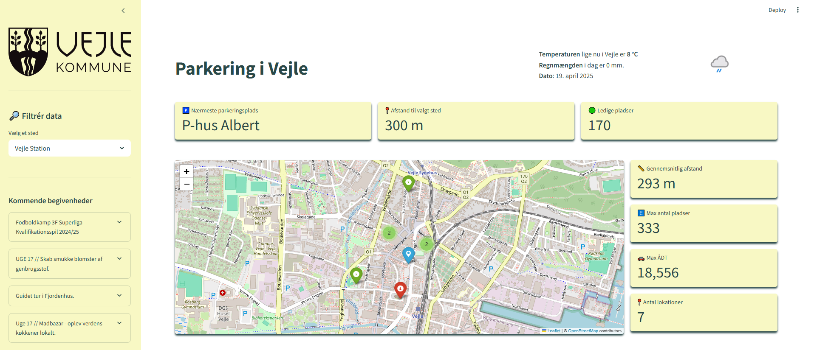

# 🅿️ Parkering i Vejle – Interaktiv Data-Visualisering

Dette projekt er en interaktiv Streamlit-applikation, der viser parkeringsmuligheder i Vejle Kommune med integration af trafikdata, vejrforhold og kommende events.

Applikationen er designet med fokus på **brugervenlighed**, **visualisering** og **kombination af åbne datasæt**.

---

## 🎯 Formål

Dette projekt er tænkt som et **visualiseringsværktøj** og en **proof-of-concept**, der viser hvordan åbne data kan bruges til at skabe værdi i hverdagen.

- Hvor man kan parkere.
- Hvor langt parkeringspladserne er fra centrale destinationer (station, rådhus, shoppingcenter m.m.).
- Hvor meget trafik der er i området (ÅDT).
- Aktuelle vejrforhold.
- Kommende begivenheder i byen.

---

## 🗺️ Funktioner

- 🗺️ **Interaktivt kort** med parkeringslokationer og detaljerede informationer.
- 🟢 **Live-data** om ledige pladser og trafikintensitet.
- 🌦️ **Vejrdata** (temperatur, regn, ikon) via WeatherAPI.
- 📍 **Afstandsmåling** til valgte vigtige steder.
- 📊 **Nøgletal** som gennemsnitlig afstand, maksimalt antal pladser, og trafikmængde.
- 📅 **Liste over begivenheder** i Vejle (fra `event.json`).

---

## 🧠 Anvendte teknologier

- [Streamlit](https://streamlit.io/) – Python-framework til webapps.
- [Folium](https://python-visualization.github.io/folium/) – Kortvisualisering.
- [Pandas](https://pandas.pydata.org/) – Databehandling.
- [Geopy](https://geopy.readthedocs.io/) – Beregning af afstande.
- [WeatherAPI](https://www.weatherapi.com/) – Hentning af live vejrdata.

---

## 🌐 Datakilder

- **Parkeringsdata**:  
  [Vejle Kommune – Parkering (OpenData.dk)](https://www.opendata.dk/city-of-vejle/vejle-parkering) 

- **Trafikdata**:  
  [Vejdirektoratet – Trafiktællinger (MÅS-TRA)](https://www.opendata.dk/vejdirektoratet/taellinger-nogletal-mastra)

- **Vejrdata**:  
  [WeatherAPI.com](https://www.weatherapi.com/)

- **Events**:  
  Lokale arrangementer i `event.json`.

---

## 🖼️ Brugerflade

> Her vises nogle af elementerne i applikationen:

- Interaktivt kort med markerede parkeringspladser.
- Sidebar med filtre og begivenheder.
- Dynamiske `metric`-bokse med nøgletal.
- Visning af temperatur og vejrikon.

---

## 🙋‍♀️ Vil du vide mere?

Hvis du er interesseret i at høre mere om projektet, dataene eller hvordan det er bygget, er du meget velkommen til at tage kontakt.

---

